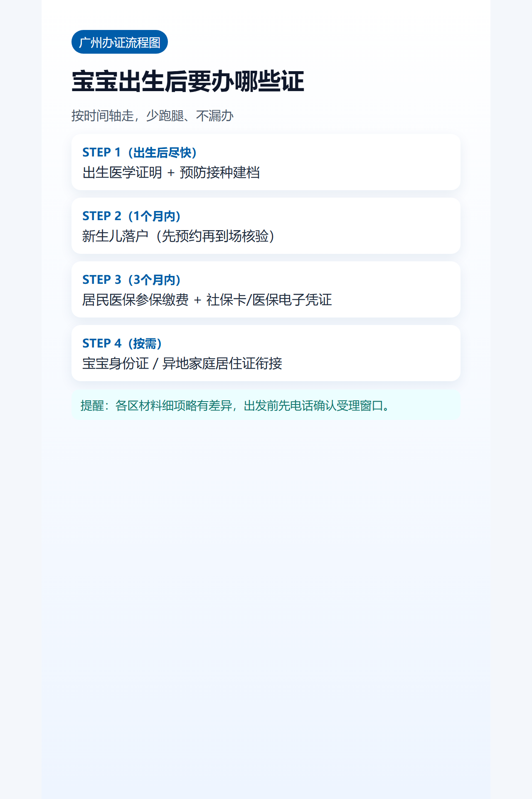

## 导语
宝宝出生后最容易乱的是顺序。这版按广州常见办事链路，先把先后关系理清，再去做材料准备。

## 流程图（可直接出图）
出生医学证明 → 预防接种建档/接种证 → 新生儿落户 → 居民医保参保缴费 → 社保卡/医保电子凭证 → 按需办身份证/居住证

## 分步骤说明
1. **出生医学证明**：作为后续户口、医保核心材料。
2. **预防接种相关**：在产院或属地接种门诊完成建档。
3. **上户口**：完成身份登记后再走医保流程更稳。
4. **医保参保**：按年度政策缴费并确认待遇起算。
5. **社保卡/电子凭证**：用于就医结算和后续线上服务。

## 常见坑位
- 先办医保但未落户，导致流程卡住。
- 材料只带复印件，窗口要求原件核验。
- 跨区办理前未确认受理口径，重复跑腿。

## 图片清单（发布用真实图）
- cover_image: 
- step_images:
  - 
  - 
  - 
- infographic: 

## 来源证据位
- source_links:
  - https://www.gz.gov.cn/zwgk/zdly/spgg/ggxx/content/post_8860757.html
  - https://gaj.gz.gov.cn/zzzq/bsfw/hzyw/content/post_10697783.html
  - https://www.gz.gov.cn/zt/shb/content/post_10501227.html
- source_capture_date: 2026-05-02
- source_notes: 广州“出生一件事”、新生儿出生登记、居民医保参保官方页面。

## 小红书发布要点
- 封面标题：出生后先办这6件证，不走弯路
- 正文结构：时间轴 + 流程图 + 避坑3条

## 公众号发布要点
- 增加“可打印清单”和“按区差异提醒”小节。