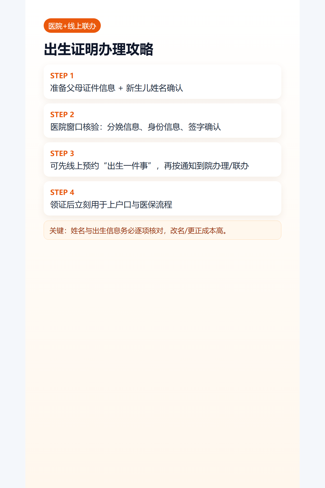

## 导语
出生医学证明是后续所有证件的起点，这篇只讲“如何一次办对”。

## 医院办理（主路径）
1. 产科/医务窗口确认可办时间。
2. 提交父母身份证明与分娩信息。
3. 核对新生儿姓名、出生信息、父母信息。
4. 签字确认并领证。

## 线上办理（预约/联办场景）
- 可先走政务平台或医院线上通道做预约。
- 部分场景支持“出生一件事”联办，按页面指引上传材料。
- 最终是否需线下核验，以签发机构通知为准。

## 补发要点
- 证件遗失后通常需按原签发机构或属地卫健口径补发。
- 先电话确认材料清单，再去窗口。

## 图片清单（发布用真实图）
- cover_image: 
- step_images:
  - 
  - 
  - 

## 来源证据位
- source_links:
  - https://www.gz.gov.cn/zwgk/zdly/spgg/ggxx/content/post_8860757.html
  - https://www.gz.gov.cn/zwfw/zxfw/sbfw/content/post_7144052.html
  - https://www.nhc.gov.cn/fys/c100078/202511/060e7aa774114ea798ca0f441c61d227.shtml
- source_capture_date: 2026-05-02
- source_notes: 广州联办场景与国家《出生医学证明》管理规范。

## 小红书发布要点
- 重点强调“姓名确认前最后核对”。

## 公众号发布要点
- 增加“超期办理与补发FAQ”。