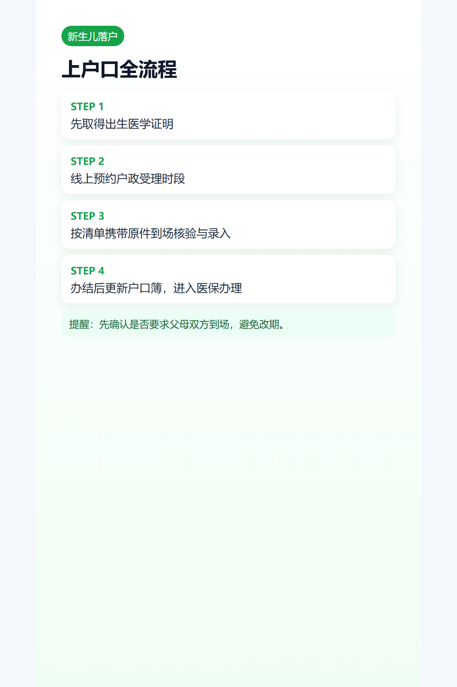

## 导语
上户口是宝宝身份体系的关键节点，核心是“材料齐+预约准+一次过”。

## 材料清单（通用框架）
- 出生医学证明
- 父母身份证明
- 户口簿
- 婚姻相关证明
- 特殊情形补充材料（按窗口要求）

## 办理步骤
1. 线上预约户政受理时段。
2. 到场取号并提交材料。
3. 窗口核验与信息录入。
4. 审核完成后办结/领证。

## 预约建议
- 先确认是否要求父母双方到场。
- 先问清原件+复印件份数。
- 如果跨区办理，先确认是否受理。

## 图片清单（发布用真实图）
- cover_image: 
- step_images:
  - 
  - 
  - 

## 来源证据位
- source_links:
  - https://gaj.gz.gov.cn/zzzq/bsfw/hzyw/content/post_10697783.html
  - https://gaj.gz.gov.cn/jmhd/zsk/hz/content/post_8555969.html
  - https://www.gz.gov.cn/zt/shb/content/post_7856606.html
- source_capture_date: 2026-05-02
- source_notes: 广州公安户政线上办理与出生登记入户须知。

## 小红书发布要点
- 用“预约前检查表”做首屏图。

## 公众号发布要点
- 增加“随父/随母落户差异说明”。