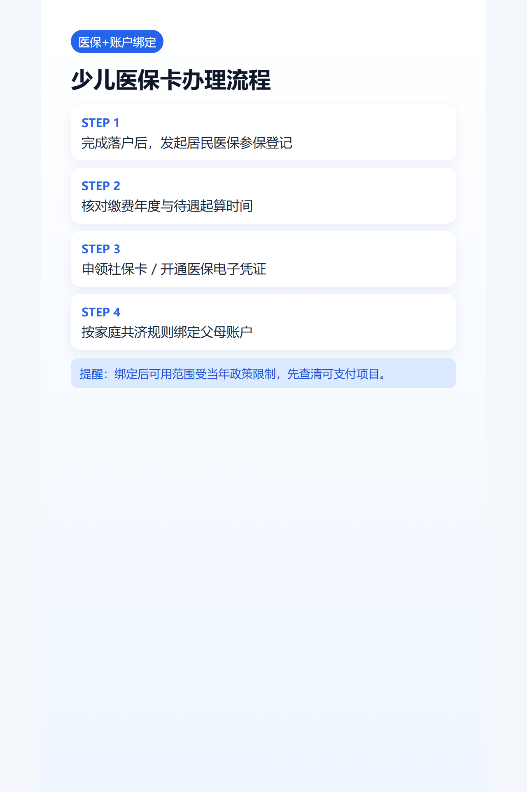

## 导语
这篇解决三件事：怎么参保、怎么缴费、怎么和父母账户绑定。

## 办理顺序
1. 先完成宝宝户口登记。
2. 办居民医保参保并缴费。
3. 跟进社保卡/医保电子凭证。
4. 按规则办理家庭共济或账户绑定。

## 办理渠道
- 线上：医保/政务服务入口
- 线下：街镇政务中心医保窗口

## 绑定父母账户注意点
- 绑定不等于“所有费用都能用父母账户”。
- 以当年家庭共济政策范围为准。
- 先确认账户状态正常，再办理绑定。

## 图片清单（发布用真实图）
- cover_image: 
- step_images:
  - 
  - 
  - 

## 来源证据位
- source_links:
  - https://www.gz.gov.cn/zt/shb/content/post_10501227.html
  - https://www.gz.gov.cn/xw/tzgg/content/post_10493722.html
  - https://www.gz.gov.cn/zwfw/zxfw/ylfw/content/post_10496352.html
- source_capture_date: 2026-05-02
- source_notes: 广州2026城乡居民医保参保缴费官方口径。

## 小红书发布要点
- 主标题：3步搞定宝宝医保，不再跑两次。

## 公众号发布要点
- 增加“待遇起算时间”图表版说明。