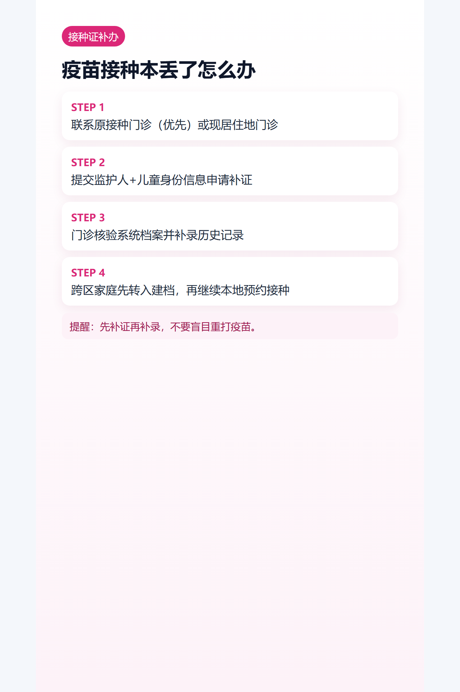

## 导语
接种证丢了不等于要重打，关键是“补证 + 补录 + 转入衔接”。

## 处理顺序
1. 联系原接种门诊（优先）。
2. 无法联系时，去现居住地接种门诊说明情况。
3. 提交监护人和儿童身份信息。
4. 由门诊核验并补发/补录记录。

## 跨区补办
- 可先在现居住地建档。
- 再同步历史接种记录。
- 后续按本地预约流程继续接种。

## 图片清单（发布用真实图）
- cover_image: 
- step_images:
  - 
  - 
  - 

## 来源证据位
- source_links:
  - https://cdcp.gd.gov.cn/hdjl/swzsk/ywzx/content/post_3442494.html
  - https://cdcp.gd.gov.cn/ywdt/zdzt/qgetyfjzxcr/jzzs/content/post_4792734.html
- source_capture_date: 2026-05-02
- source_notes: 广东疾控关于接种证补办与电子接种证并行使用说明。

## 小红书发布要点
- 强调“先补证，不要盲目重打”。

## 公众号发布要点
- 增加“哪些情况需要疾控协助”FAQ。