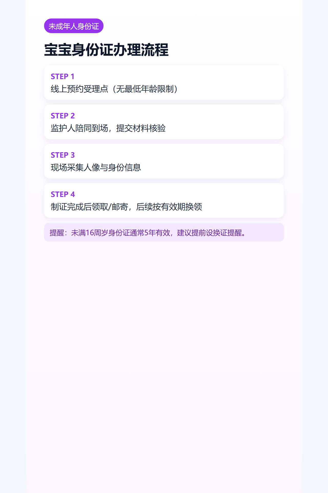

## 导语
很多家长以为宝宝不能办身份证，实际是可以的，而且用途比想象中多。

## 关键结论
- 宝宝出生后即可办理居民身份证（无最低年龄限制）。
- 需监护人陪同，按受理点要求提交材料并采集信息。

## 有什么用
- 医疗实名就诊
- 交通出行购票
- 银行/保险等实名业务
- 多类政务事项办理

## 办理流程
1. 预约受理点
2. 监护人陪同到场
3. 信息采集与核验
4. 制证后领取/邮寄

## 图片清单（发布用真实图）
- cover_image: 
- step_images:
  - 
  - 
  - 

## 来源证据位
- source_links:
  - https://www.gdzwfw.gov.cn/portal/simple-guide/11440106007508683Q4442106043001
  - https://www.gz.gov.cn/zwfw/zxfw/ggfw/content/post_9577113.html
  - https://www.gz.gov.cn/zwfw/zxfw/ggfw/content/mpost_9768815.html
- source_capture_date: 2026-05-02
- source_notes: 广东政务服务网与广州未成年人身份证办理官方说明。

## 小红书发布要点
- 标题钩子：宝宝身份证越早办越省事？

## 公众号发布要点
- 增加“有效期与换领时间线”卡片。