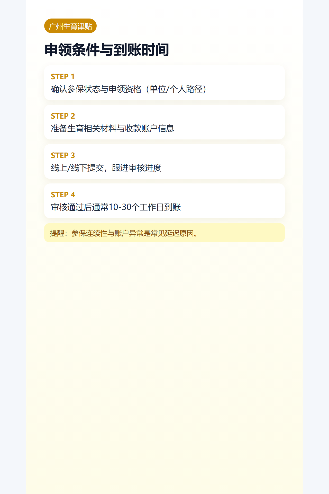

## 导语
这篇只讲你最关心的三件事：能不能领、怎么领、多久到账。

## 谁能领
- 在职参保且符合生育保险政策条件。
- 单位申报或个人申报路径，以经办口径为准。

## 申领流程
1. 准备生育相关与身份材料。
2. 线上/线下提交申报。
3. 经办审核。
4. 审核通过后发放。

## 到账时间（广州常见）
- 材料齐全且审核通过后，常见区间为 10-30 个工作日。
- 高峰期或材料补正会延长。

## 常见卡点
- 参保连续性不足
- 材料不一致
- 收款账户异常

## 图片清单（发布用真实图）
- cover_image: 
- step_images:
  - 
  - 
  - 

## 来源证据位
- source_links:
  - https://www.gz.gov.cn/zwfw/zxfw/sbfw/content/post_10571978.html
  - https://www.gz.gov.cn/zt/shb/content/post_10710793.html
  - https://www.gz.gov.cn/zwfw/zxfw/ylfw/content/post_9618389.html
- source_capture_date: 2026-05-02
- source_notes: 广州生育津贴“发放到个人”与申领进度/到账口径官方页面。

## 小红书发布要点
- 用“到账时间轴”做主图。

## 公众号发布要点
- 增加“工资与津贴关系”案例说明。