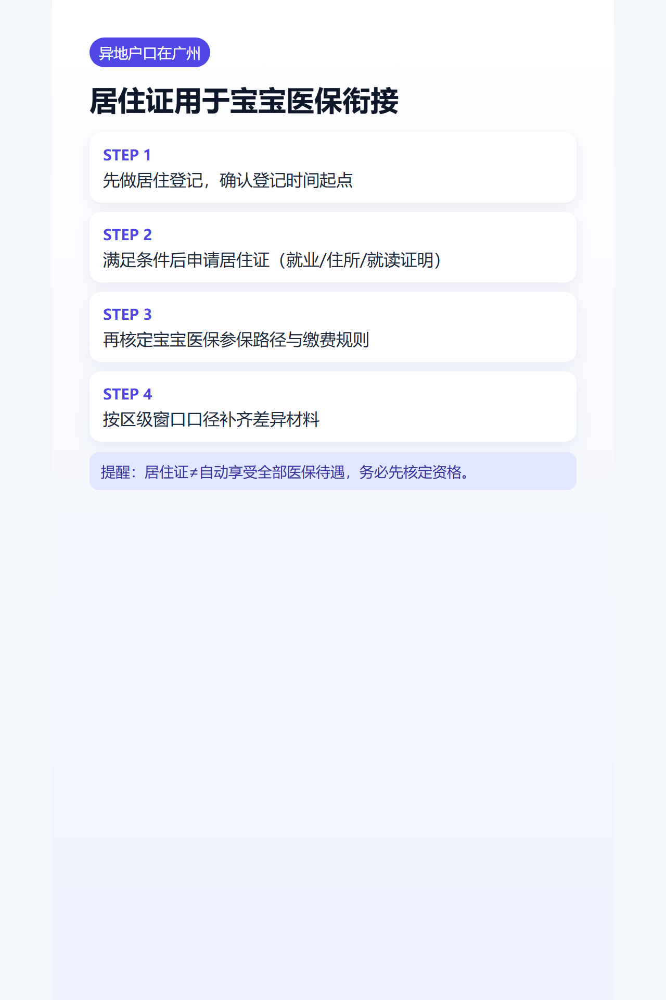

## 导语
异地户口家庭常卡在“居住证和宝宝医保怎么衔接”，这篇按办理顺序给你拆开。

## 办理顺序
1. 先做居住登记。
2. 满足条件后申请居住证。
3. 再去核定宝宝医保参保路径与待遇起算。

## 常见材料（按受理口径）
- 身份证明
- 居住证明
- 就业/就读/住所证明之一

## 宝宝医保衔接提醒
- 居住证不等于自动获得全部医保待遇。
- 需按参保地与年度政策核定资格与缴费方式。

## 办理建议
- 先电话咨询所在区窗口，再预约。
- 把“居住登记时间”“参保时间点”做成时间轴，避免断档。

## 图片清单（发布用真实图）
- cover_image: 
- step_images:
  - 
  - 
  - 

## 来源证据位
- source_links:
  - https://zsj.gz.gov.cn/zmhd/cjwt/shbapp/content/post_10146719.html
  - https://www.gz.gov.cn/zt/shb/content/mpost_10275571.html
  - https://www.gz.gov.cn/gfxwj/sbmgfxwj/gzsgaj/content/post_5485453.html
- source_capture_date: 2026-05-02
- source_notes: 广州居住证申领条件、入口与居住登记/居住证办理指引。

## 小红书发布要点
- 主标题：异地户口在广州办宝宝医保，别漏这一步。

## 公众号发布要点
- 增加“按区差异咨询清单”。